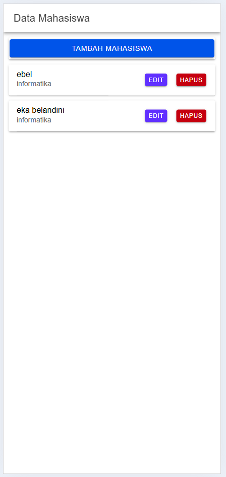
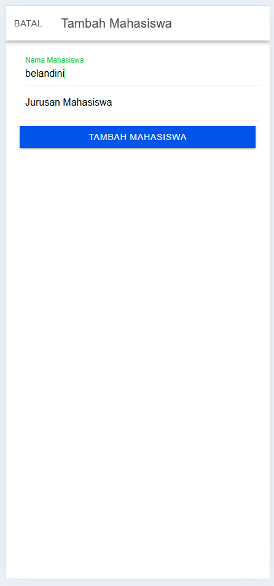
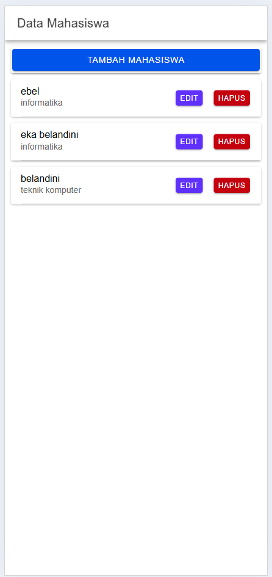
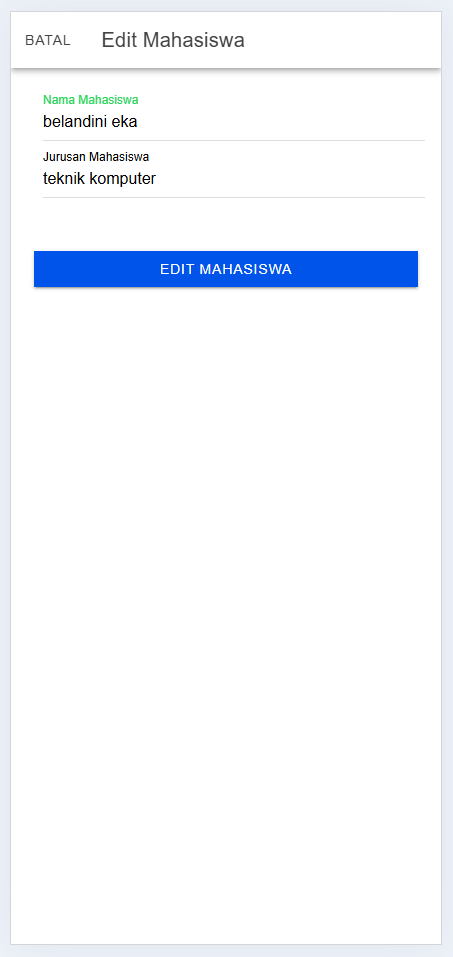
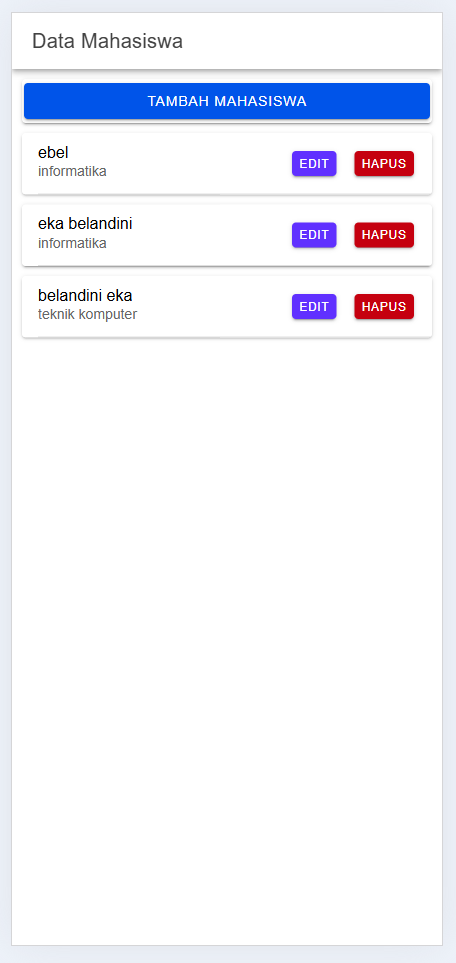
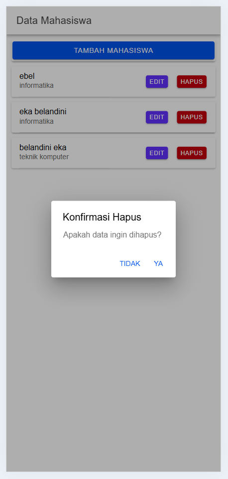
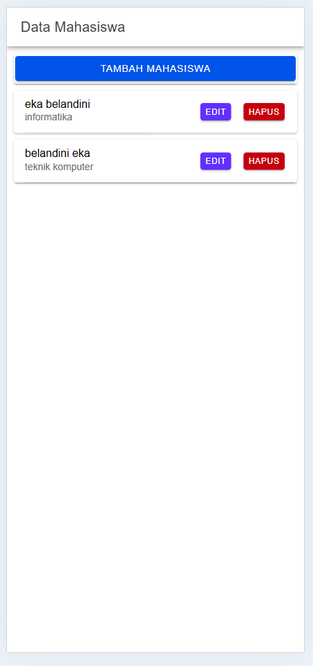

# Tugas 8 - Pertemuan 9

**Nama**  : Eka Belandini  
**NIM**   : H1D022002  
**Shift** : F

## Deskripsi Proyek

Proyek ini adalah aplikasi mobile sederhana yang dikembangkan menggunakan framework Ionic dan Angular. Aplikasi ini bertujuan untuk menampilkan dan mengelola data mahasiswa, memungkinkan pengguna untuk menambah, mengedit, dan menghapus data mahasiswa melalui antarmuka sederhana.

## Fitur Utama

- **Form Tambah Mahasiswa**: Pengguna dapat menambah data mahasiswa.
- **Form Edit Mahasiswa**: Pengguna dapat mengedit data mahasiswa yang sudah ada.
- **Hapus Mahasiswa dengan Konfirmasi**: Pengguna dapat menghapus data mahasiswa setelah konfirmasi.
- **Daftar Mahasiswa**: Menampilkan daftar data mahasiswa yang telah ditambahkan.

## Cara Kerja CRUD

### Alur Kerja

1. **Tampil Data Mahasiswa**:
   - Data mahasiswa ditampilkan dalam bentuk daftar kartu di halaman utama.
2. **Tambah Data Mahasiswa**:
   - Pengguna mengklik tombol "Tambah Mahasiswa" untuk membuka modal tambah, memasukkan data, dan mengirimkan data ke server.
3. **Edit Data Mahasiswa**:
   - Pengguna mengklik tombol "Edit" pada kartu mahasiswa untuk mengedit data yang sudah ada.
4. **Hapus Data Mahasiswa dengan Konfirmasi**:
   - Pengguna mengklik tombol "Hapus" pada kartu mahasiswa, dan konfirmasi penghapusan akan muncul untuk memastikan tindakan.

### Struktur File

- **mahasiswa.page.ts**:
  - Mengatur logika utama untuk menampilkan, menambah, mengedit, dan menghapus data mahasiswa.
- **mahasiswa.page.html**:
  - Template yang menampilkan daftar mahasiswa dan form CRUD dalam modal.
- **api.service.ts**:
  - Berisi fungsi untuk berkomunikasi dengan server melalui metode HTTP.

## Demo Aplikasi

### Screenshot Halaman Daftar Mahasiswa (Awal)
<br/>

Halaman ini menampilkan daftar mahasiswa yang sudah tersimpan di database. Setiap mahasiswa ditampilkan dengan nama dan jurusan. Di setiap kartu mahasiswa terdapat tombol untuk mengedit dan menghapus data.

### Screenshot Tambah Data Mahasiswa

1. **Sebelum Menambah Data Mahasiswa**
   <br/>

   Sebelum menambah data mahasiswa baru, daftar mahasiswa hanya memuat data yang telah tersimpan.

2. **Saat Mengisi Form Tambah Mahasiswa**
   <br/>

   Pengguna memasukkan nama dan jurusan mahasiswa yang baru. Setelah menekan tombol "Tambah Mahasiswa," data akan dikirim ke server.

3. **Setelah Berhasil Menambah Data Mahasiswa**
   <br/>

   Data mahasiswa yang baru akan ditampilkan pada daftar mahasiswa setelah berhasil ditambahkan.

### Screenshot Edit Data Mahasiswa

1. **Sebelum Mengedit Data Mahasiswa**
   <br/>

   Data mahasiswa yang ditampilkan sebelum dilakukan pengeditan.

2. **Saat Mengisi Form Edit Mahasiswa**
   <br/>

   Pengguna memperbarui nama atau jurusan mahasiswa di form edit. Setelah menekan tombol "Edit Mahasiswa," data akan diperbarui di server.

3. **Setelah Berhasil Mengedit Data Mahasiswa**
   <br/>

   Data mahasiswa yang diperbarui akan ditampilkan pada daftar mahasiswa setelah berhasil disimpan.

### Screenshot Hapus Data Mahasiswa dengan Konfirmasi

1. **Sebelum Menghapus Data Mahasiswa**
   <br/>

   Tampilan data mahasiswa yang akan dihapus sebelum proses konfirmasi.

2. **Konfirmasi Hapus Data Mahasiswa**
   <br/>

   Konfirmasi hapus muncul untuk memastikan apakah pengguna ingin menghapus data mahasiswa tersebut.

3. **Setelah Berhasil Menghapus Data Mahasiswa**
   <br/>

   Data mahasiswa akan dihapus dari daftar setelah pengguna mengonfirmasi.

## Cara Menjalankan Aplikasi

1. **Instalasi Ionic**:
   - Pastikan Anda sudah menginstal Ionic CLI. Jika belum, instal dengan perintah:
     ```bash
     npm install -g @ionic/cli
     ```
2. **Clone Proyek**:
   - Clone repository proyek ke komputer Anda:
     ```bash
     git clone https://github.com/username/nama-repository.git
     ```
3. **Instalasi Dependensi**:
   - Masuk ke direktori proyek dan instal dependensi:
     ```bash
     cd nama-repository
     npm install
     ```
4. **Menjalankan Aplikasi**:
   - Jalankan aplikasi di browser dengan perintah:
     ```bash
     ionic serve
     ```

---
